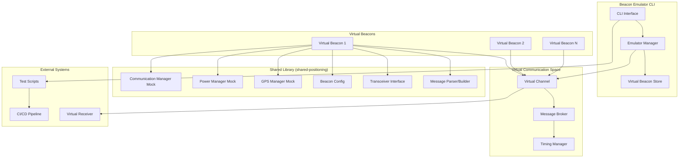
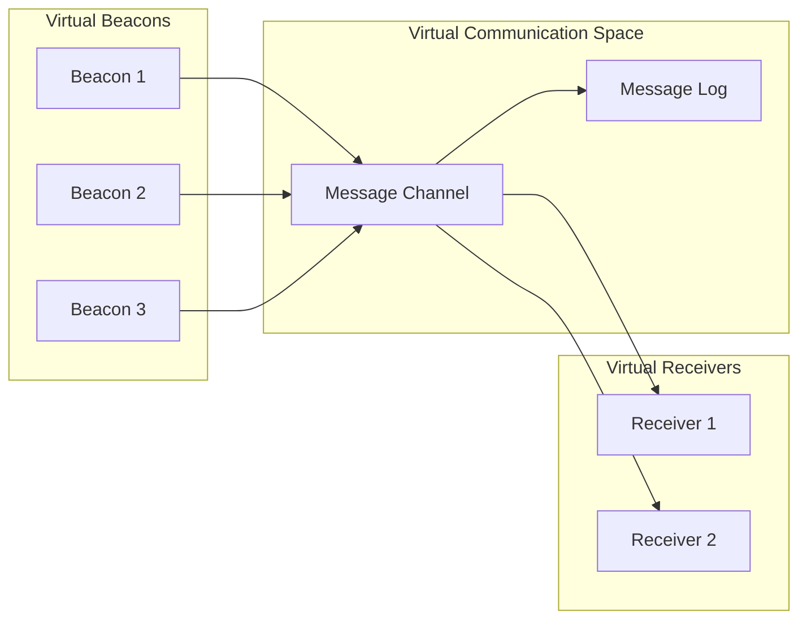

# Design Document

## Overview

The beacon emulator/simulator is a CLI-based tool that creates and manages virtual beacons for testing the underwater positioning system. It leverages the existing shared positioning library and mimics real beacon behavior by transmitting the same message formats and protocols. The emulator provides a virtual communication space where multiple virtual beacons can operate simultaneously, allowing comprehensive testing of receiver systems, positioning algorithms, and system integration without physical hardware.

The design emphasizes simplicity and reliability over complex propagation modeling, focusing on providing accurate message delivery and timing for effective system testing. The emulator integrates seamlessly with existing development workflows and supports both interactive CLI usage and automated testing scenarios.

## Architecture

### High-Level Architecture



### Virtual Communication Space Architecture

The virtual communication space provides a simple broadcast medium that connects virtual beacons to virtual receivers:



## Components and Interfaces

### CLI Interface

The CLI provides commands for managing virtual beacons and test scenarios:

```rust
use clap::{Parser, Subcommand};
use uuid::Uuid;
use std::path::PathBuf;

#[derive(Parser)]
#[command(name = "beacon-emulator")]
#[command(about = "Virtual beacon emulator for underwater positioning system testing")]
pub struct Cli {
    /// Virtual communication channel (shared with receivers)
    #[arg(short, long, default_value = "default")]
    channel: String,
    
    /// Log level
    #[arg(short, long, default_value = "info")]
    log_level: String,
    
    #[command(subcommand)]
    command: EmulatorCommand,
}

#[derive(Subcommand)]
pub enum EmulatorCommand {
    /// Create a new virtual beacon
    Create {
        /// Beacon ID (UUID or auto-generate)
        #[arg(short, long)]
        id: Option<Uuid>,
        
        /// Latitude in degrees
        #[arg(long)]
        lat: f64,
        
        /// Longitude in degrees  
        #[arg(long)]
        lon: f64,
        
        /// Depth in meters (positive down)
        #[arg(long, default_value = "0.0")]
        depth: f64,
        
        /// Configuration file to initialize beacon
        #[arg(short, long)]
        config: Option<PathBuf>,
        
        /// Transmission interval in milliseconds
        #[arg(long, default_value = "5000")]
        interval: u32,
        
        /// Message version (V1, V2, V3)
        #[arg(long, default_value = "V3")]
        version: MessageVersion,
    },
    
    /// List active virtual beacons
    List {
        /// Show detailed information
        #[arg(short, long)]
        detailed: bool,
    },
    
    /// Stop a virtual beacon
    Stop {
        /// Beacon ID to stop
        id: Uuid,
    },
    
    /// Stop all virtual beacons
    StopAll,
    
    /// Update beacon configuration
    Update {
        /// Beacon ID to update
        id: Uuid,
        
        /// New position (lat,lon,depth)
        #[arg(long)]
        position: Option<String>,
        
        /// New transmission interval
        #[arg(long)]
        interval: Option<u32>,
        
        /// Movement pattern (stationary, linear, circular, random)
        #[arg(long)]
        movement: Option<MovementPattern>,
    },
    
    /// Create predefined test scenario
    Scenario {
        /// Scenario type (triangle, square, line)
        scenario_type: ScenarioType,
        
        /// Number of beacons
        #[arg(short, long, default_value = "4")]
        count: usize,
        
        /// Spacing between beacons in meters
        #[arg(short, long, default_value = "100.0")]
        spacing: f64,
        
        /// Center position (lat,lon,depth)
        #[arg(long, default_value = "32.123,45.476,10.0")]
        center: String,
    },
    
    /// Monitor virtual beacon activity
    Monitor {
        /// Specific beacon ID to monitor
        #[arg(short, long)]
        beacon: Option<Uuid>,
        
        /// Update interval in seconds
        #[arg(long, default_value = "1")]
        interval: u64,
    },
    
    /// Export beacon activity logs
    Export {
        /// Output file path
        #[arg(short, long)]
        output: PathBuf,
        
        /// Export format (json, csv)
        #[arg(short, long, default_value = "json")]
        format: ExportFormat,
        
        /// Time range in seconds (from now)
        #[arg(long, default_value = "3600")]
        duration: u64,
    },
}
```

### Virtual Beacon Implementation

Virtual beacons extend the existing beacon architecture with emulation-specific features:

```rust
use shared_positioning::{
    BeaconConfig, MessageBuilder, MockGpsManager, MockPowerManager, 
    MockCommunicationManager, MockTransceiver, GeodeticPosition
};
use uuid::Uuid;
use tokio::time::{interval, Duration};

pub struct VirtualBeacon {
    id: Uuid,
    config: BeaconConfig,
    position: GeodeticPosition,
    movement_pattern: MovementPattern,
    message_builder: MessageBuilder,
    sequence_number: u16,
    is_running: bool,
    virtual_channel: VirtualChannel,
    stats: VirtualBeaconStats,
}

impl VirtualBeacon {
    pub fn new(
        id: Uuid,
        config: BeaconConfig,
        initial_position: GeodeticPosition,
        virtual_channel: VirtualChannel,
    ) -> Result<Self, EmulatorError> {
        Ok(Self {
            id,
            config,
            position: initial_position,
            movement_pattern: MovementPattern::Stationary,
            message_builder: MessageBuilder::new(),
            sequence_number: 0,
            is_running: false,
            virtual_channel,
            stats: VirtualBeaconStats::new(),
        })
    }
    
    pub async fn start(&mut self) -> Result<(), EmulatorError> {
        self.is_running = true;
        self.run_transmission_loop().await
    }
    
    pub fn stop(&mut self) {
        self.is_running = false;
    }
    
    pub fn update_position(&mut self, position: GeodeticPosition) {
        self.position = position;
    }
    
    pub fn set_movement_pattern(&mut self, pattern: MovementPattern) {
        self.movement_pattern = pattern;
    }
    
    async fn run_transmission_loop(&mut self) -> Result<(), EmulatorError> {
        let mut interval = interval(Duration::from_millis(
            self.config.transmission_interval_ms as u64
        ));
        
        while self.is_running {
            interval.tick().await;
            
            // Update position based on movement pattern
            self.update_position_from_movement();
            
            // Build and transmit message
            self.transmit_message().await?;
            
            // Update statistics
            self.stats.messages_sent += 1;
            self.stats.last_transmission = Some(std::time::SystemTime::now());
        }
        
        Ok(())
    }
    
    fn update_position_from_movement(&mut self) {
        match &self.movement_pattern {
            MovementPattern::Stationary => {
                // No movement
            }
            MovementPattern::Linear { speed_m_per_s, bearing_deg } => {
                // Update position based on linear movement
                let dt = self.config.transmission_interval_ms as f64 / 1000.0;
                let distance = speed_m_per_s * dt;
                
                // Simple linear movement calculation
                let bearing_rad = bearing_deg.to_radians();
                let lat_offset = distance * bearing_rad.cos() / 111_132.0;
                let lon_offset = distance * bearing_rad.sin() / 
                    (111_320.0 * self.position.latitude.to_radians().cos());
                
                self.position.latitude += lat_offset;
                self.position.longitude += lon_offset;
            }
            MovementPattern::Circular { radius_m, period_s } => {
                // Circular movement around initial position
                let elapsed = self.stats.messages_sent as f64 * 
                    self.config.transmission_interval_ms as f64 / 1000.0;
                let angle = 2.0 * std::f64::consts::PI * elapsed / period_s;
                
                // Calculate offset from center
                let lat_offset = radius_m * angle.cos() / 111_132.0;
                let lon_offset = radius_m * angle.sin() / 
                    (111_320.0 * self.position.latitude.to_radians().cos());
                
                // Apply offset to initial position (stored separately)
                // This would require storing the initial center position
            }
            MovementPattern::Random { max_speed_m_per_s } => {
                // Random walk movement
                use rand::Rng;
                let mut rng = rand::thread_rng();
                
                let dt = self.config.transmission_interval_ms as f64 / 1000.0;
                let max_distance = max_speed_m_per_s * dt;
                
                let distance = rng.gen::<f64>() * max_distance;
                let bearing = rng.gen::<f64>() * 2.0 * std::f64::consts::PI;
                
                let lat_offset = distance * bearing.cos() / 111_132.0;
                let lon_offset = distance * bearing.sin() / 
                    (111_320.0 * self.position.latitude.to_radians().cos());
                
                self.position.latitude += lat_offset;
                self.position.longitude += lon_offset;
            }
        }
    }
    
    async fn transmit_message(&mut self) -> Result<(), EmulatorError> {
        // Build message using shared library
        let message = self.message_builder.build_v3_message(
            self.id,
            self.position,
            255, // Full signal quality for virtual beacons
            self.sequence_number,
        ).map_err(|e| EmulatorError::MessageBuildError(e.to_string()))?;
        
        // Transmit to virtual channel
        self.virtual_channel.broadcast_message(VirtualMessage {
            beacon_id: self.id,
            timestamp: std::time::SystemTime::now(),
            position: self.position,
            message_data: message,
            signal_quality: 255,
        }).await?;
        
        // Update sequence number
        self.sequence_number = self.sequence_number.wrapping_add(1);
        
        Ok(())
    }
    
    pub fn get_status(&self) -> VirtualBeaconStatus {
        VirtualBeaconStatus {
            id: self.id,
            position: self.position,
            is_running: self.is_running,
            movement_pattern: self.movement_pattern.clone(),
            stats: self.stats.clone(),
            config: self.config.clone(),
        }
    }
}
```

### Virtual Communication Space

The virtual communication space provides a simple broadcast medium:

```rust
use tokio::sync::broadcast;
use std::collections::HashMap;
use uuid::Uuid;

pub struct VirtualCommunicationSpace {
    channels: HashMap<String, VirtualChannel>,
}

impl VirtualCommunicationSpace {
    pub fn new() -> Self {
        Self {
            channels: HashMap::new(),
        }
    }
    
    pub fn get_or_create_channel(&mut self, name: &str) -> VirtualChannel {
        self.channels.entry(name.to_string())
            .or_insert_with(|| VirtualChannel::new(name))
            .clone()
    }
    
    pub fn list_channels(&self) -> Vec<String> {
        self.channels.keys().cloned().collect()
    }
}

#[derive(Clone)]
pub struct VirtualChannel {
    name: String,
    sender: broadcast::Sender<VirtualMessage>,
    message_log: Arc<Mutex<Vec<VirtualMessage>>>,
}

impl VirtualChannel {
    pub fn new(name: &str) -> Self {
        let (sender, _) = broadcast::channel(1000); // Buffer up to 1000 messages
        
        Self {
            name: name.to_string(),
            sender,
            message_log: Arc::new(Mutex::new(Vec::new())),
        }
    }
    
    pub async fn broadcast_message(&self, message: VirtualMessage) -> Result<(), EmulatorError> {
        // Log message
        {
            let mut log = self.message_log.lock().await;
            log.push(message.clone());
            
            // Keep only recent messages (last 10000)
            if log.len() > 10000 {
                log.drain(0..1000);
            }
        }
        
        // Broadcast to subscribers
        self.sender.send(message)
            .map_err(|_| EmulatorError::ChannelError("No receivers".to_string()))?;
        
        Ok(())
    }
    
    pub fn subscribe(&self) -> broadcast::Receiver<VirtualMessage> {
        self.sender.subscribe()
    }
    
    pub async fn get_recent_messages(&self, count: usize) -> Vec<VirtualMessage> {
        let log = self.message_log.lock().await;
        log.iter().rev().take(count).cloned().collect()
    }
    
    pub async fn get_messages_since(&self, since: std::time::SystemTime) -> Vec<VirtualMessage> {
        let log = self.message_log.lock().await;
        log.iter()
            .filter(|msg| msg.timestamp >= since)
            .cloned()
            .collect()
    }
}

#[derive(Debug, Clone)]
pub struct VirtualMessage {
    pub beacon_id: Uuid,
    pub timestamp: std::time::SystemTime,
    pub position: GeodeticPosition,
    pub message_data: Vec<u8>,
    pub signal_quality: u8,
}
```

### Emulator Manager

The emulator manager coordinates virtual beacons and provides the main API:

```rust
use std::collections::HashMap;
use uuid::Uuid;
use tokio::task::JoinHandle;

pub struct EmulatorManager {
    virtual_beacons: HashMap<Uuid, VirtualBeacon>,
    beacon_tasks: HashMap<Uuid, JoinHandle<()>>,
    communication_space: VirtualCommunicationSpace,
    current_channel: String,
}

impl EmulatorManager {
    pub fn new(channel_name: &str) -> Self {
        let mut communication_space = VirtualCommunicationSpace::new();
        let current_channel = channel_name.to_string();
        
        Self {
            virtual_beacons: HashMap::new(),
            beacon_tasks: HashMap::new(),
            communication_space,
            current_channel,
        }
    }
    
    pub async fn create_beacon(
        &mut self,
        id: Option<Uuid>,
        position: GeodeticPosition,
        config: Option<BeaconConfig>,
    ) -> Result<Uuid, EmulatorError> {
        let beacon_id = id.unwrap_or_else(Uuid::new_v4);
        
        if self.virtual_beacons.contains_key(&beacon_id) {
            return Err(EmulatorError::BeaconExists(beacon_id));
        }
        
        let beacon_config = config.unwrap_or_else(|| BeaconConfig::default_for_emulator());
        let virtual_channel = self.communication_space.get_or_create_channel(&self.current_channel);
        
        let mut virtual_beacon = VirtualBeacon::new(
            beacon_id,
            beacon_config,
            position,
            virtual_channel,
        )?;
        
        // Start beacon in background task
        let beacon_task = {
            let mut beacon_clone = virtual_beacon.clone();
            tokio::spawn(async move {
                if let Err(e) = beacon_clone.start().await {
                    eprintln!("Virtual beacon {} error: {}", beacon_id, e);
                }
            })
        };
        
        self.virtual_beacons.insert(beacon_id, virtual_beacon);
        self.beacon_tasks.insert(beacon_id, beacon_task);
        
        Ok(beacon_id)
    }
    
    pub async fn stop_beacon(&mut self, id: Uuid) -> Result<(), EmulatorError> {
        if let Some(mut beacon) = self.virtual_beacons.remove(&id) {
            beacon.stop();
            
            if let Some(task) = self.beacon_tasks.remove(&id) {
                task.abort();
            }
            
            Ok(())
        } else {
            Err(EmulatorError::BeaconNotFound(id))
        }
    }
    
    pub async fn stop_all_beacons(&mut self) -> Result<(), EmulatorError> {
        let beacon_ids: Vec<Uuid> = self.virtual_beacons.keys().cloned().collect();
        
        for id in beacon_ids {
            self.stop_beacon(id).await?;
        }
        
        Ok(())
    }
    
    pub fn list_beacons(&self) -> Vec<VirtualBeaconStatus> {
        self.virtual_beacons.values()
            .map(|beacon| beacon.get_status())
            .collect()
    }
    
    pub async fn update_beacon_position(
        &mut self,
        id: Uuid,
        position: GeodeticPosition,
    ) -> Result<(), EmulatorError> {
        if let Some(beacon) = self.virtual_beacons.get_mut(&id) {
            beacon.update_position(position);
            Ok(())
        } else {
            Err(EmulatorError::BeaconNotFound(id))
        }
    }
    
    pub async fn create_scenario(
        &mut self,
        scenario_type: ScenarioType,
        count: usize,
        spacing: f64,
        center: GeodeticPosition,
    ) -> Result<Vec<Uuid>, EmulatorError> {
        let positions = generate_scenario_positions(scenario_type, count, spacing, center)?;
        let mut beacon_ids = Vec::new();
        
        for position in positions {
            let id = self.create_beacon(None, position, None).await?;
            beacon_ids.push(id);
        }
        
        Ok(beacon_ids)
    }
    
    pub async fn export_logs(
        &self,
        output_path: &std::path::Path,
        format: ExportFormat,
        duration_s: u64,
    ) -> Result<(), EmulatorError> {
        let since = std::time::SystemTime::now() - std::time::Duration::from_secs(duration_s);
        let channel = self.communication_space.get_or_create_channel(&self.current_channel);
        let messages = channel.get_messages_since(since).await;
        
        match format {
            ExportFormat::Json => export_json(output_path, &messages).await,
            ExportFormat::Csv => export_csv(output_path, &messages).await,
        }
    }
}
```

## Data Models

### Configuration and Status Models

```rust
use serde::{Serialize, Deserialize};
use uuid::Uuid;
use shared_positioning::{BeaconConfig, GeodeticPosition};

#[derive(Debug, Clone, Serialize, Deserialize)]
pub enum MovementPattern {
    Stationary,
    Linear {
        speed_m_per_s: f64,
        bearing_deg: f64,
    },
    Circular {
        radius_m: f64,
        period_s: f64,
    },
    Random {
        max_speed_m_per_s: f64,
    },
}

#[derive(Debug, Clone)]
pub enum ScenarioType {
    Triangle,
    Square,
    Line,
    Grid { rows: usize, cols: usize },
}

#[derive(Debug, Clone)]
pub struct VirtualBeaconStatus {
    pub id: Uuid,
    pub position: GeodeticPosition,
    pub is_running: bool,
    pub movement_pattern: MovementPattern,
    pub stats: VirtualBeaconStats,
    pub config: BeaconConfig,
}

#[derive(Debug, Clone)]
pub struct VirtualBeaconStats {
    pub messages_sent: u64,
    pub last_transmission: Option<std::time::SystemTime>,
    pub uptime: std::time::Duration,
    pub transmission_failures: u32,
}

impl VirtualBeaconStats {
    pub fn new() -> Self {
        Self {
            messages_sent: 0,
            last_transmission: None,
            uptime: std::time::Duration::new(0, 0),
            transmission_failures: 0,
        }
    }
}

#[derive(Debug, Clone)]
pub enum ExportFormat {
    Json,
    Csv,
}
```

### Error Handling

```rust
use thiserror::Error;
use uuid::Uuid;

#[derive(Error, Debug)]
pub enum EmulatorError {
    #[error("Beacon {0} already exists")]
    BeaconExists(Uuid),
    
    #[error("Beacon {0} not found")]
    BeaconNotFound(Uuid),
    
    #[error("Message build error: {0}")]
    MessageBuildError(String),
    
    #[error("Channel error: {0}")]
    ChannelError(String),
    
    #[error("Configuration error: {0}")]
    ConfigError(String),
    
    #[error("IO error: {0}")]
    IoError(#[from] std::io::Error),
    
    #[error("Serialization error: {0}")]
    SerializationError(#[from] serde_json::Error),
    
    #[error("Invalid scenario parameters: {0}")]
    InvalidScenario(String),
}
```

## Testing Strategy

### Unit Testing

1. **Virtual Beacon Components**
   - Message building and transmission
   - Movement pattern calculations
   - Configuration management
   - Statistics tracking

2. **Virtual Communication Space**
   - Message broadcasting and delivery
   - Channel management
   - Message logging and retrieval
   - Subscriber management

3. **CLI Interface**
   - Command parsing and validation
   - Error handling and reporting
   - Configuration file loading
   - Output formatting

### Integration Testing

1. **End-to-End Scenarios**
   - Create virtual beacons and verify message transmission
   - Test multiple beacons with different configurations
   - Validate message format compatibility with receivers
   - Test scenario generation and management

2. **Virtual Communication Testing**
   - Multiple beacons broadcasting simultaneously
   - Message delivery to multiple virtual receivers
   - Channel isolation and message routing
   - Performance under high message rates

3. **CLI Workflow Testing**
   - Complete beacon lifecycle management
   - Configuration updates and validation
   - Log export and analysis
   - Error recovery and cleanup

### Performance Testing

1. **Scalability Testing**
   - 50+ virtual beacons operating simultaneously
   - Message throughput and latency measurement
   - Memory usage and resource consumption
   - System stability under load

2. **Timing Accuracy**
   - Transmission interval precision
   - Message timestamp accuracy
   - Movement pattern timing
   - Synchronization between beacons

### Mock Testing Framework

```rust
pub struct MockVirtualChannel {
    pub sent_messages: Vec<VirtualMessage>,
    pub should_fail: bool,
}

impl MockVirtualChannel {
    pub fn new() -> Self {
        Self {
            sent_messages: Vec::new(),
            should_fail: false,
        }
    }
    
    pub async fn broadcast_message(&mut self, message: VirtualMessage) -> Result<(), EmulatorError> {
        if self.should_fail {
            return Err(EmulatorError::ChannelError("Mock failure".to_string()));
        }
        
        self.sent_messages.push(message);
        Ok(())
    }
    
    pub fn get_message_count(&self) -> usize {
        self.sent_messages.len()
    }
}

pub struct EmulatorTestHarness {
    pub emulator: EmulatorManager,
    pub mock_channel: MockVirtualChannel,
}

impl EmulatorTestHarness {
    pub fn new() -> Self {
        Self {
            emulator: EmulatorManager::new("test"),
            mock_channel: MockVirtualChannel::new(),
        }
    }
    
    pub async fn create_test_beacon(&mut self) -> Result<Uuid, EmulatorError> {
        let position = GeodeticPosition {
            latitude: 32.123,
            longitude: 45.476,
            altitude: -10.0,
        };
        
        self.emulator.create_beacon(None, position, None).await
    }
}
```

## Implementation Considerations

### Configuration File Support

The emulator supports loading beacon configurations from existing beacon config files:

```rust
pub async fn load_beacon_config(config_path: &Path) -> Result<BeaconConfig, EmulatorError> {
    let config_content = tokio::fs::read_to_string(config_path).await?;
    let config: BeaconConfig = toml::from_str(&config_content)
        .map_err(|e| EmulatorError::ConfigError(format!("Invalid TOML: {}", e)))?;
    
    // Validate configuration for emulator use
    validate_emulator_config(&config)?;
    
    Ok(config)
}

fn validate_emulator_config(config: &BeaconConfig) -> Result<(), EmulatorError> {
    // Ensure configuration is suitable for emulation
    if config.transmission_interval_ms < 100 {
        return Err(EmulatorError::ConfigError(
            "Transmission interval too short for emulation".to_string()
        ));
    }
    
    Ok(())
}
```

### Scenario Generation

Predefined scenarios help create common test configurations:

```rust
fn generate_scenario_positions(
    scenario_type: ScenarioType,
    count: usize,
    spacing: f64,
    center: GeodeticPosition,
) -> Result<Vec<GeodeticPosition>, EmulatorError> {
    match scenario_type {
        ScenarioType::Triangle => {
            if count != 3 {
                return Err(EmulatorError::InvalidScenario(
                    "Triangle scenario requires exactly 3 beacons".to_string()
                ));
            }
            
            let mut positions = Vec::new();
            for i in 0..3 {
                let angle = (i as f64) * 2.0 * std::f64::consts::PI / 3.0;
                let lat_offset = spacing * angle.cos() / 111_132.0;
                let lon_offset = spacing * angle.sin() / 
                    (111_320.0 * center.latitude.to_radians().cos());
                
                positions.push(GeodeticPosition {
                    latitude: center.latitude + lat_offset,
                    longitude: center.longitude + lon_offset,
                    altitude: center.altitude,
                });
            }
            
            Ok(positions)
        }
        
        ScenarioType::Square => {
            if count != 4 {
                return Err(EmulatorError::InvalidScenario(
                    "Square scenario requires exactly 4 beacons".to_string()
                ));
            }
            
            let half_spacing = spacing / 2.0;
            let positions = vec![
                GeodeticPosition {
                    latitude: center.latitude + half_spacing / 111_132.0,
                    longitude: center.longitude + half_spacing / 
                        (111_320.0 * center.latitude.to_radians().cos()),
                    altitude: center.altitude,
                },
                GeodeticPosition {
                    latitude: center.latitude + half_spacing / 111_132.0,
                    longitude: center.longitude - half_spacing / 
                        (111_320.0 * center.latitude.to_radians().cos()),
                    altitude: center.altitude,
                },
                GeodeticPosition {
                    latitude: center.latitude - half_spacing / 111_132.0,
                    longitude: center.longitude + half_spacing / 
                        (111_320.0 * center.latitude.to_radians().cos()),
                    altitude: center.altitude,
                },
                GeodeticPosition {
                    latitude: center.latitude - half_spacing / 111_132.0,
                    longitude: center.longitude - half_spacing / 
                        (111_320.0 * center.latitude.to_radians().cos()),
                    altitude: center.altitude,
                },
            ];
            
            Ok(positions)
        }
        
        ScenarioType::Line => {
            let mut positions = Vec::new();
            let start_offset = -(count as f64 - 1.0) * spacing / 2.0;
            
            for i in 0..count {
                let offset = start_offset + (i as f64) * spacing;
                let lat_offset = offset / 111_132.0;
                
                positions.push(GeodeticPosition {
                    latitude: center.latitude + lat_offset,
                    longitude: center.longitude,
                    altitude: center.altitude,
                });
            }
            
            Ok(positions)
        }
        
        ScenarioType::Grid { rows, cols } => {
            if count != rows * cols {
                return Err(EmulatorError::InvalidScenario(
                    format!("Grid scenario requires {} beacons for {}x{} grid", rows * cols, rows, cols)
                ));
            }
            
            let mut positions = Vec::new();
            let row_start = -(rows as f64 - 1.0) * spacing / 2.0;
            let col_start = -(cols as f64 - 1.0) * spacing / 2.0;
            
            for row in 0..rows {
                for col in 0..cols {
                    let lat_offset = (row_start + (row as f64) * spacing) / 111_132.0;
                    let lon_offset = (col_start + (col as f64) * spacing) / 
                        (111_320.0 * center.latitude.to_radians().cos());
                    
                    positions.push(GeodeticPosition {
                        latitude: center.latitude + lat_offset,
                        longitude: center.longitude + lon_offset,
                        altitude: center.altitude,
                    });
                }
            }
            
            Ok(positions)
        }
    }
}
```

This design provides a comprehensive foundation for the beacon emulator that meets all the requirements while maintaining simplicity and reliability. The emulator integrates seamlessly with the existing shared positioning library and provides the virtual communication space needed for testing receiver systems.