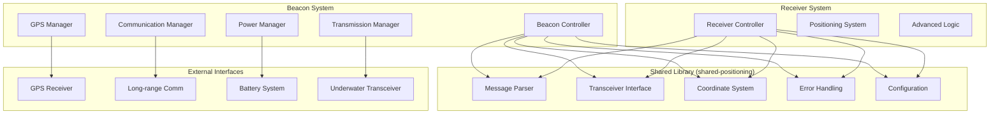

# Design Document

## Overview

The beacons system provides autonomous underwater positioning reference points that broadcast their precise locations to underwater receivers. The system consists of surface-floating or depth-anchored beacons equipped with GPS receivers, power management systems, and long-range communication capabilities. The design emphasizes code reuse through a shared library architecture, robust power management, and reliable communication protocols.

## Architecture

### High-Level Architecture



### Shared Library Architecture

The shared library (`shared-positioning`) extracts common functionality from the receiver system:

- **Message Parser**: Handles V1/V2 message formats, validation, and checksums
- **Transceiver Interface**: Hardware abstraction for underwater communication
- **Coordinate System**: GPS coordinate transformations and validation
- **Error Handling**: Comprehensive error classification and recovery
- **Configuration**: System and component configuration management

### Beacon-Specific Components

- **Beacon Controller**: Main orchestration and state management
- **GPS Manager**: GPS acquisition, position tracking, and accuracy monitoring
- **Power Manager**: Battery monitoring, charging control, and power optimization
- **Communication Manager**: Long-range communication abstraction layer
- **Transmission Manager**: Underwater message broadcasting coordination

## Components and Interfaces

### Shared Library Components

#### Message Parser (Extracted from receiver)
```rust
use uuid::Uuid;

pub struct MessageBuilder {
    pub fn build_v1_message(&self, beacon_id: Uuid, position: GeodeticPosition, 
                           signal_quality: u8, sequence: u16) -> Result<Vec<u8>, MessageError>;
    pub fn build_v2_message(&self, beacon_id: Uuid, position: GeodeticPosition, 
                           signal_quality: u8, sequence: u16) -> Result<Vec<u8>, MessageError>;
}
```

**Note**: The message format will need to be extended to accommodate UUID beacon IDs (16 bytes vs 2 bytes for u16). This will require:
- New message version (V3) with UUID support
- Backward compatibility with existing V1/V2 formats for receivers
- Efficient UUID encoding/decoding for underwater transmission

#### Transceiver Interface (Extended from receiver)
```rust
pub trait TransceiverInterface {
    fn transmit_message(&mut self, data: &[u8]) -> Result<(), CommError>;
    fn set_transmission_power(&mut self, power_level: u8) -> Result<(), CommError>;
    fn get_transmission_status(&self) -> TransmissionStatus;
}
```

### Beacon-Specific Interfaces

#### GPS Manager
```rust
pub trait GpsManager {
    fn start_acquisition(&mut self) -> Result<(), GpsError>;
    fn get_current_position(&self) -> Option<GpsPosition>;
    fn get_position_accuracy(&self) -> Option<f32>;
    fn is_locked(&self) -> bool;
    fn get_satellite_count(&self) -> u8;
    fn configure(&mut self, config: GpsConfig) -> Result<(), GpsError>;
}

pub struct GpsPosition {
    pub latitude: f64,
    pub longitude: f64,
    pub altitude: f64,
    pub timestamp: SystemTime,
    pub accuracy_m: f32,
    pub satellite_count: u8,
}
```

#### Power Manager
```rust
pub trait PowerManager {
    fn get_battery_status(&self) -> BatteryStatus;
    fn get_charging_status(&self) -> ChargingStatus;
    fn set_power_mode(&mut self, mode: PowerMode) -> Result<(), PowerError>;
    fn estimate_remaining_time(&self) -> Duration;
    fn configure_power_thresholds(&mut self, config: PowerConfig) -> Result<(), PowerError>;
}

pub struct BatteryStatus {
    pub voltage_v: f32,
    pub current_ma: f32,
    pub capacity_percent: f32,
    pub temperature_c: f32,
    pub health: BatteryHealth,
}

pub enum PowerMode {
    Normal,
    PowerSave,
    Emergency,
    Shutdown,
}
```

#### Communication Manager
```rust
pub trait CommunicationManager {
    fn connect(&mut self) -> Result<(), CommError>;
    fn disconnect(&mut self) -> Result<(), CommError>;
    fn send_status_report(&mut self, report: StatusReport) -> Result<(), CommError>;
    fn check_for_updates(&mut self) -> Result<Option<ConfigUpdate>, CommError>;
    fn is_connected(&self) -> bool;
    fn get_signal_strength(&self) -> Option<u8>;
}

pub struct StatusReport {
    pub beacon_id: Uuid,
    pub timestamp: SystemTime,
    pub position_history: Vec<GpsPosition>,
    pub battery_status: BatteryStatus,
    pub system_health: SystemHealth,
    pub transmission_stats: TransmissionStats,
}
```

#### Beacon Controller
```rust
use uuid::Uuid;

pub struct BeaconController {
    pub fn new(config: BeaconConfig) -> Result<Self, BeaconError>;
    pub fn start(&mut self) -> Result<(), BeaconError>;
    pub fn stop(&mut self) -> Result<(), BeaconError>;
    pub fn update_configuration(&mut self, config: BeaconConfig) -> Result<(), BeaconError>;
    pub fn get_status(&self) -> BeaconStatus;
    pub fn handle_emergency(&mut self, emergency_type: EmergencyType) -> Result<(), BeaconError>;
}
```

## Data Models

### Configuration Models

```rust
use uuid::Uuid;

#[derive(Debug, Clone, Serialize, Deserialize)]
pub struct BeaconConfig {
    pub beacon_id: Uuid,
    pub transmission_interval_ms: u32,
    pub message_version: MessageVersion,
    pub gps_config: GpsConfig,
    pub power_config: PowerConfig,
    pub communication_config: CommunicationConfig,
    pub emergency_config: EmergencyConfig,
}

#[derive(Debug, Clone, Serialize, Deserialize)]
pub struct GpsConfig {
    pub acquisition_timeout_s: u32,
    pub update_interval_s: u32,
    pub min_satellite_count: u8,
    pub accuracy_threshold_m: f32,
    pub cold_start_timeout_s: u32,
}

#[derive(Debug, Clone, Serialize, Deserialize)]
pub struct PowerConfig {
    pub low_battery_threshold_percent: f32,
    pub critical_battery_threshold_percent: f32,
    pub emergency_battery_threshold_percent: f32,
    pub power_save_mode_threshold_percent: f32,
    pub charging_enabled: bool,
    pub solar_charging_enabled: bool,
}

#[derive(Debug, Clone, Serialize, Deserialize)]
pub struct CommunicationConfig {
    pub connection_interval_hours: u32,
    pub retry_attempts: u32,
    pub retry_backoff_ms: u32,
    pub max_retry_interval_hours: u32,
    pub connection_timeout_s: u32,
    pub data_compression_enabled: bool,
}
```

### Runtime Data Models

```rust
use uuid::Uuid;

#[derive(Debug, Clone)]
pub struct BeaconStatus {
    pub beacon_id: Uuid,
    pub operational_state: OperationalState,
    pub gps_status: GpsStatus,
    pub battery_status: BatteryStatus,
    pub communication_status: CommunicationStatus,
    pub transmission_stats: TransmissionStats,
    pub uptime: Duration,
    pub last_error: Option<BeaconError>,
}

#[derive(Debug, Clone)]
pub enum OperationalState {
    Initializing,
    GpsAcquisition,
    Normal,
    PowerSave,
    Emergency,
    Shutdown,
    Error(String),
}

#[derive(Debug, Clone)]
pub struct TransmissionStats {
    pub messages_sent: u64,
    pub transmission_failures: u32,
    pub last_transmission_time: Option<SystemTime>,
    pub average_transmission_interval_ms: u32,
    pub signal_quality_history: Vec<u8>,
}
```

## Error Handling

### Beacon-Specific Error Types

```rust
#[derive(Debug, Clone)]
pub enum BeaconError {
    GpsError(GpsError),
    PowerError(PowerError),
    CommunicationError(CommError),
    TransmissionError(TransmissionError),
    ConfigurationError(ConfigError),
    SystemError(SystemError),
}

#[derive(Debug, Clone)]
pub enum GpsError {
    AcquisitionTimeout,
    SignalLost,
    AccuracyTooLow { current: f32, required: f32 },
    HardwareFault,
    ConfigurationInvalid,
}

#[derive(Debug, Clone)]
pub enum PowerError {
    BatteryDepleted,
    ChargingFault,
    TemperatureExtreme { temperature_c: f32 },
    VoltageOutOfRange { voltage_v: f32 },
    CurrentOverload { current_ma: f32 },
}

#[derive(Debug, Clone)]
pub enum TransmissionError {
    TransceiverFault,
    MessageBuildFailed,
    PowerInsufficient,
    SchedulingConflict,
    HardwareTimeout,
}
```

### Error Recovery Strategies

- **GPS Errors**: Retry acquisition, fallback to last known position, reduce transmission frequency
- **Power Errors**: Enter power save mode, reduce transmission power, initiate emergency shutdown
- **Communication Errors**: Exponential backoff retry, store data locally, continue autonomous operation
- **Transmission Errors**: Retry with reduced power, switch message version, reset transceiver

## Testing Strategy

### Unit Testing

1. **Shared Library Components**
   - Message parser/builder functionality
   - Coordinate system transformations
   - Error handling and recovery logic
   - Configuration validation

2. **Beacon-Specific Components**
   - GPS manager position acquisition and accuracy
   - Power manager battery monitoring and thresholds
   - Communication manager connection and data transfer
   - Transmission manager message scheduling and delivery

### Integration Testing

1. **GPS Integration**
   - Real GPS receiver hardware testing
   - Position accuracy validation
   - Signal acquisition timing
   - Environmental condition handling

2. **Power System Integration**
   - Battery monitoring accuracy
   - Charging system functionality
   - Power mode transitions
   - Emergency shutdown procedures

3. **Communication Integration**
   - Long-range communication link testing
   - Data compression and transmission
   - Configuration update mechanisms
   - Connection reliability under various conditions

4. **End-to-End System Testing**
   - Complete beacon deployment scenarios
   - Receiver integration testing
   - Multi-beacon coordination
   - Extended operation testing

### Mock Testing Framework

```rust
pub struct MockGpsManager {
    // Configurable GPS simulation
    pub simulated_positions: VecDeque<GpsPosition>,
    pub acquisition_delay: Duration,
    pub accuracy_variation: f32,
}

pub struct MockPowerManager {
    // Battery simulation
    pub simulated_battery_level: f32,
    pub discharge_rate: f32,
    pub charging_enabled: bool,
}

pub struct MockCommunicationManager {
    // Communication simulation
    pub connection_success_rate: f64,
    pub transmission_delay: Duration,
    pub simulated_updates: VecDeque<ConfigUpdate>,
}
```

### Performance Testing

1. **Power Consumption Analysis**
   - Measure current draw in different operational modes
   - Validate battery life estimates
   - Optimize power usage patterns

2. **Transmission Performance**
   - Message delivery reliability
   - Signal range and quality
   - Interference handling

3. **GPS Performance**
   - Time to first fix (TTFF)
   - Position accuracy over time
   - Signal acquisition in challenging conditions

4. **System Reliability**
   - Long-term operation stability
   - Error recovery effectiveness
   - Configuration update reliability

### Test Data and Scenarios

1. **GPS Test Scenarios**
   - Clear sky conditions
   - Partial satellite visibility
   - Signal interference
   - Cold start conditions
   - Position accuracy validation

2. **Power Test Scenarios**
   - Normal discharge cycles
   - Charging system operation
   - Temperature extremes
   - Emergency power conditions

3. **Communication Test Scenarios**
   - Reliable connection conditions
   - Intermittent connectivity
   - Extended disconnection periods
   - Configuration update scenarios

4. **Environmental Test Scenarios**
   - Marine environment conditions
   - Temperature variations
   - Humidity and corrosion resistance
   - Mechanical stress and vibration