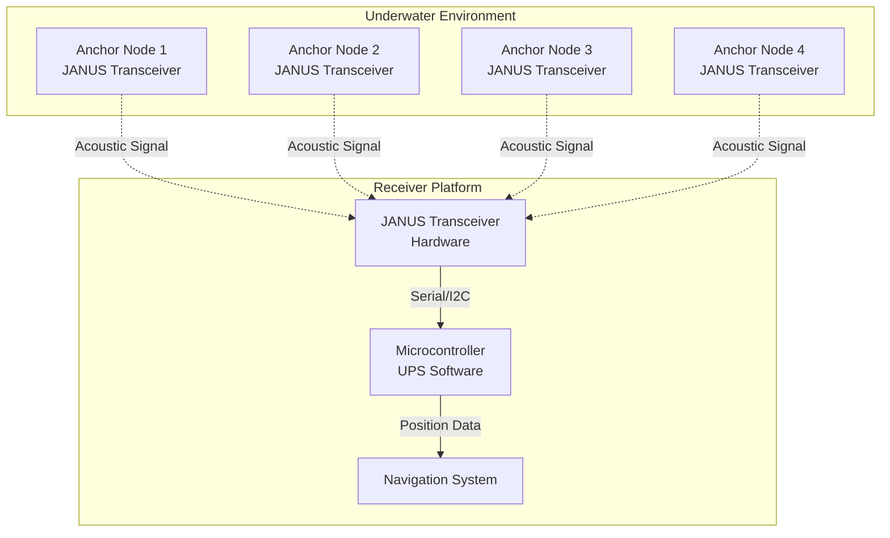
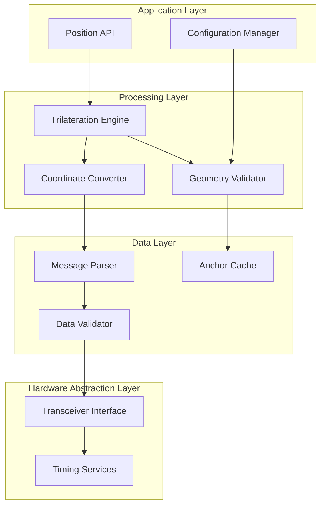

# Design Document

## Overview

The Underwater Positioning System (UPS) is designed as a modular, microcontroller-optimized solution that transforms acoustic ranging data from JANUS transceivers into precise 3D positioning information. The system architecture separates concerns between low-level acoustic communication (handled by JANUS transceivers) and high-level positioning calculations (handled by the UPS software).

The design prioritizes computational efficiency, memory optimization, and real-time performance to enable deployment on resource-constrained embedded systems while maintaining the mathematical precision required for accurate underwater navigation.

## Architecture

### System Architecture Overview



### Software Architecture

The UPS software follows a layered architecture optimized for embedded systems:



## Components and Interfaces

### Core Components

#### 1. Transceiver Interface Module
**Purpose:** Manages communication with JANUS transceivers
**Key Functions:**
- Serial/I2C communication protocol handling
- Message framing and error detection
- Multi-transceiver support for redundancy
- Hardware abstraction for different transceiver models

**Interface:**
```rust
pub trait TransceiverInterface {
    fn read_message(&mut self) -> Result<RawMessage, CommError>;
    fn get_status(&self) -> TransceiverStatus;
    fn configure(&mut self, config: TransceiverConfig) -> Result<(), CommError>;
}
```

#### 2. Message Parser
**Purpose:** Converts raw transceiver data into structured anchor information
**Key Functions:**
- Parse JANUS message payloads
- Extract anchor ID, timestamp, and position data
- Validate message integrity and format
- Handle different message versions/formats

**Data Structures:**
```rust
pub struct AnchorMessage {
    pub anchor_id: u16,
    pub timestamp_ms: u64,
    pub position: GeodeticPosition,
    pub signal_quality: u8,
    pub message_sequence: u16,
}

pub struct GeodeticPosition {
    pub latitude: f64,
    pub longitude: f64,
    pub depth: f64,
}
```

#### 3. Trilateration Engine
**Purpose:** Core positioning calculations optimized for embedded systems
**Key Functions:**
- 3D and 2D trilateration algorithms
- Least-squares optimization for overdetermined systems
- Geometric quality assessment
- Error propagation and uncertainty estimation

**Algorithm Selection:**
- **3+ Anchors:** Linearized least-squares trilateration
- **Poor Geometry:** Regularized least-squares (Tikhonov regularization)
- **Coplanar Anchors:** 2D trilateration with depth estimation
- **3 Anchors Only:** 2D solution with weighted depth averaging

#### 4. Coordinate System Manager
**Purpose:** Handles coordinate transformations and reference frame management
**Key Functions:**
- Geodetic to local tangent plane conversion
- Local tangent plane to geodetic conversion
- Reference point management
- Precision optimization for local operations

#### 5. Geometry Validator
**Purpose:** Assesses anchor configuration quality and positioning reliability
**Key Functions:**
- Dilution of Precision (DOP) calculations
- Anchor collinearity detection
- Tetrahedron volume analysis
- Condition number assessment

### Memory-Optimized Data Structures

#### Fixed-Point Arithmetic Support
For microcontrollers without floating-point units:
```rust
pub struct FixedPoint32 {
    value: i32,
    scale: u8,
}

pub struct LocalPosition {
    pub east_mm: i32,    // millimeters east
    pub north_mm: i32,   // millimeters north  
    pub down_mm: i32,    // millimeters down
}
```

#### Circular Buffer for Anchor Data
```rust
pub struct AnchorBuffer<const N: usize> {
    messages: [Option<AnchorMessage>; N],
    head: usize,
    count: usize,
}
```

## Data Models

### Primary Data Models

#### Position Representation
```rust
pub struct PositionResult {
    pub geodetic: GeodeticPosition,
    pub local: LocalPosition,
    pub accuracy_estimate: f32,
    pub timestamp_ms: u64,
    pub anchor_count: u8,
    pub geometry_quality: GeometryQuality,
}

pub enum GeometryQuality {
    Excellent,      // DOP < 2.0
    Good,          // DOP < 5.0
    Acceptable,    // DOP < 10.0
    Poor,          // DOP >= 10.0
    Degenerate,    // Nearly singular
}
```

#### Configuration Data
```rust
pub struct SystemConfig {
    pub sound_speed_ms: f32,
    pub max_anchor_age_ms: u32,
    pub min_anchors: u8,
    pub position_timeout_ms: u32,
    pub accuracy_threshold_m: f32,
}

pub struct AnchorConfig {
    pub id: u16,
    pub position: GeodeticPosition,
    pub max_range_m: f32,
    pub enabled: bool,
}
```

### Memory Layout Optimization

#### Packed Structures for Embedded Systems
```rust
#[repr(C, packed)]
pub struct CompactAnchorMessage {
    pub anchor_id: u16,
    pub timestamp_ms: u32,      // Relative timestamp
    pub lat_micro_deg: i32,     // Latitude * 1e6
    pub lon_micro_deg: i32,     // Longitude * 1e6
    pub depth_mm: u16,          // Depth in millimeters
    pub quality: u8,
}
```

## Error Handling

### Error Classification
```rust
pub enum PositioningError {
    InsufficientAnchors { available: u8, required: u8 },
    DegenerateGeometry { condition_number: f32 },
    StaleData { oldest_anchor_age_ms: u32 },
    ComputationFailure { details: String },
    TransceiverError { transceiver_id: u8, error: CommError },
}
```

### Error Recovery Strategies
1. **Insufficient Anchors:** Wait for additional signals, use last known position
2. **Poor Geometry:** Apply regularization, increase uncertainty estimates
3. **Stale Data:** Extrapolate position, reduce confidence
4. **Computation Errors:** Fallback to simpler algorithms, report degraded accuracy

### Graceful Degradation
- **4 → 3 Anchors:** Switch to 2D positioning with depth estimation
- **3 → 2 Anchors:** Provide bearing/range to nearest anchor
- **Poor Signal Quality:** Increase uncertainty bounds, apply filtering

## Testing Strategy

### Unit Testing Approach
1. **Mathematical Validation:** Test trilateration algorithms against known solutions
2. **Edge Case Handling:** Validate behavior with degenerate anchor configurations
3. **Performance Testing:** Measure computation time and memory usage
4. **Precision Testing:** Verify coordinate transformation accuracy

### Integration Testing
1. **Transceiver Interface:** Mock JANUS transceiver responses
2. **End-to-End Positioning:** Simulate complete positioning scenarios
3. **Error Handling:** Test recovery from various failure modes
4. **Real-time Performance:** Validate timing requirements under load

### Hardware-in-the-Loop Testing
1. **Microcontroller Deployment:** Test on target hardware platforms
2. **Power Consumption:** Measure battery life under operational conditions
3. **Environmental Testing:** Validate performance across temperature ranges
4. **Acoustic Testing:** Test with actual JANUS transceivers in controlled environments

### Test Data Sets
```rust
pub struct TestScenario {
    pub name: &'static str,
    pub anchors: Vec<AnchorMessage>,
    pub expected_position: GeodeticPosition,
    pub expected_accuracy: f32,
    pub geometry_quality: GeometryQuality,
}
```

## Performance Considerations

### Computational Optimization
1. **Matrix Operations:** Use specialized embedded linear algebra libraries
2. **Trigonometric Functions:** Implement lookup tables for common calculations
3. **Memory Access:** Optimize data layout for cache efficiency
4. **Algorithm Selection:** Choose algorithms based on available anchor count

### Real-time Constraints
- **Position Update Rate:** Target 5-10 Hz for dynamic platforms
- **Latency Budget:** <200ms from signal reception to position output
- **Memory Footprint:** <32KB RAM, <128KB flash for core functionality
- **Power Efficiency:** Optimize for battery-powered operation

### Scalability Considerations
- **Multiple Receivers:** Support for fleet positioning scenarios
- **Extended Range:** Handle anchor networks spanning several kilometers
- **High-Precision Mode:** Optional double-precision calculations for survey applications
- **Adaptive Algorithms:** Automatically adjust processing based on available resources